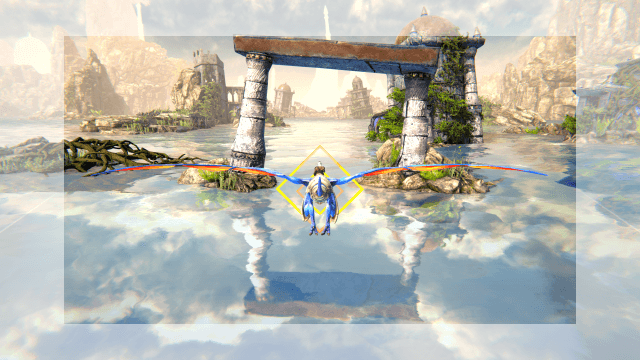

# LightgunDragoon
Panzer Dragoon Remake was not meant to be played with a lightgun and even with this plugin, the gameplay will differ from a classic lightgun title.

The crosshair is moved by the relative movement of the lightgun on the screen, it is not positioned absolutely. I tried to match the movements as much as possible, but an exact match was not possible due to the different control concepts. This is like emulating an analog stick with a lightgun.

There is an outer border that takes about ten percent of the screen. If you hold the lightgun in that area, flight maneuvers are executed to change the position of the dragon rider and dodge attacks.

The inner area of the screen is meant for taking a semi-stable flight position, aiming and firing. Shoot from the hip, don't use the sights.

Just try it out, move the lightgun slowly across the screen and see how the game reacts. After a short while you should get the hang of it.

How to use:
- Download the release zip
- Extract it into the main folder of the game
- Assign Q and E to your lightgun buttons to turn around while flying
- Run the Panzer Dragoon Remake
- Set input mode to classic
- Sensitivity of 1.0 is recommended but you can adjust it
- Classic reticle is recommended but not required